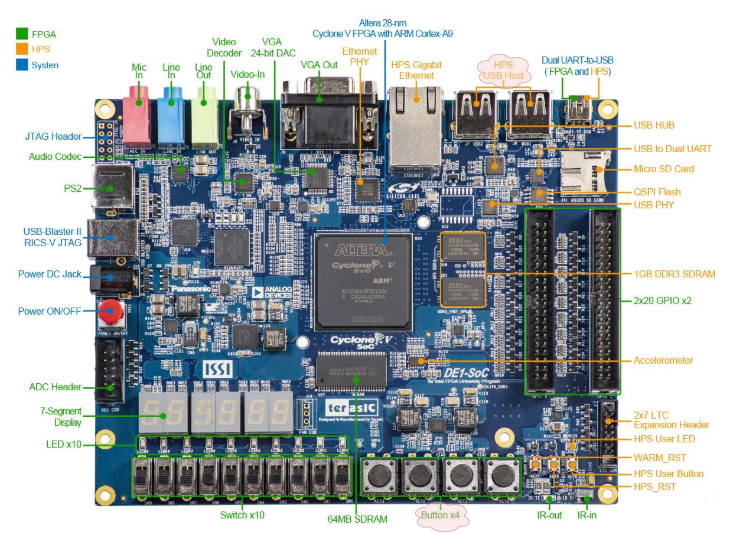
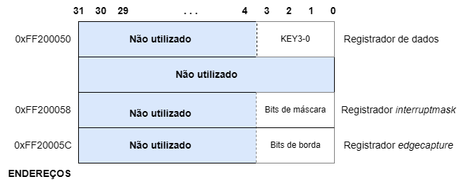
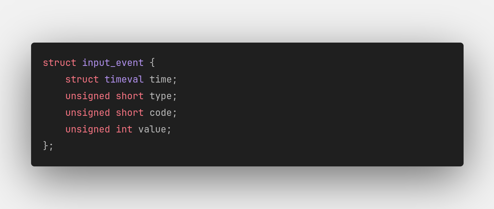

<h1 align="center"> Sistema-Digital-TicTacToe</h1>

Projeto de console dedicado em plataforma de desenvolvimento de hardware

<h2>Introdução</h2>

Nos últimos anos, os jogos digitais emergiram como uma forma de entretenimento profundamente influente e culturalmente significativa. Desde os primórdios dos jogos de computador e consoles de videogame até a era contemporânea dos jogos móveis e realidade virtual, a indústria de jogos digitais tem evoluído constantemente. Contudo, é importante o papel dos jogos digitais clássicos, que representam os pilares fundamentais da indústria, transcendendo fronteiras geográficas e geracionais.

Esses clássicos não apenas resistiram ao teste do tempo, mas também continuam a ser celebrados como marcos históricos que ajudaram a moldar o meio dos jogos digitais como o conhecemos hoje. Um desses emblemáticos passatempo é o conhecido Jogo Da Velha ou <i>Tic-Tac-Toe</i> que, apesar da sua origem remontar há mais de 3.500 anos no antigo Egito, e com sua dinâmica simples é um dos jogos mais populares do mundo.

Dessa maneira, este projeto tem como intuito desenvolver um console que implemente uma versão do clássico Jogo Da Velha como Problema 1 do componente curricular TEC499 Sistemas Digitais. Para executar o sistema, o Kit de desenvolvimento DE1-SoC é utilizado provendo uma interface aos jogadores para inicar uma partida acionando um botão e preencher o tabuleiro alternadamente através do mouse USB até que um empate ou uma vitória ocorram. As soluções, softwares e dispositivos utilizadas no desenvolvimento serão abordadas nas seções subsequentes.

<h3>Requisitos</h3>

A solução deve atender às condições e aos requisitos predetermminados, de modo que o jogo deve:
<ul>
  <li>Ser executado em uma interface em modo texto, que possa ser visualizada via terminal</li>
  <li>Permitir a interação de dois jogadores</li>
  <li>Captar a posição de marcação da jogada no tabuleiro, assim como a confirmação da ação, por meio de um mouse conectado a uma das portas USB da placa</li>
  <li>Utilizar os botões e chaves disponíveis na placa para iniciar, terminar e demais controles.</li>
  <li>Ter seu código escrito em linguagem C;</li>
  <li>Só poderá utilizar os componentes disponíveis na placa DE1-SoC.</li>
</ul>

<!--Neste contexto dinâmico, explorar os jogos digitais não apenas como formas de entretenimento, mas também como expressões artísticas, ferramentas educacionais e plataformas sociais, revela a diversidade e o potencial impacto dessa forma de mídia na sociedade contemporânea.-->

<h2>Equipe</h2>
<ul>
  <li>Brenda Barbosa</li>
  <li>Camila</li>
  <li>Maike</li>
</ul>
<!-- Sumário pra configurar depois

  
Sumário

  <ol>
    <li>xkmx</li>
    <li>
      <ol type="1">
        <li>nlsc</li>
        <li>m sx</li>
      </ol>
  </li>
  </ol>

-->

<h2>Softwares Utilizados</h2>
Nessa seção são apresentados os softwares que auxiliaram no desenvolvimento do sistema.

<h3>Linguagem C</h3>

É uma linguagem de programação de propósito geral que combina abstrações e controles de baixo nível sobre o hardware resultando em ganho de eficiência. O software criado em 1970 por Dennis Ritchie é estreitamente associada ao sistema operacional UNIX, uma vez que as versões desse sistema foram escritas em linguagem C. Além disso, a sintaxe simples e a alta portabilidade desta linguagem entre dispositivos contribui para seu amplo uso em sistemas embarcados de recursos limitados.

<h3>Compilador GNU</h3>

O <i>GNU Compiler Collection GCC</i>(Coleção de Compiladores GNU) ou GCC é um conjunto de compiladores de código aberto desenvolvido pelo Projeto GNU que oferecem suporte a uma gama de linguagens de programação, incluindo C, C++, Fortran, Ada, Go. Esta ferramenta otimiza a compilação, ou seja a produção de código de máquina, nas várias linguagens e arquiteturas de processadores suportadas.

<h3>VS Code</h3>

O Visual Studio Code ou VS Code é editor de texto gratuito com suporte a várias linguagens, incluido Python, Java, C, C++, JavaScript. A ferramenta desenvolvida pela Microsoft dispõe de diversos recursos de depuração, destaque de erros, sugestões, personalização e demais recursos para auxiliar a codificação. Desse modo, o editor foi um dos ambientes utilizados no desenvolvimento do código fonte do jogo.

<h3>Nano</h3>

Também, o editor de texto simples Nano, na versão 2.2.6, presente no Linux embarcado do Kit de desenvolvimento DE1-SoC foi utilizado para codificação da solução. O Nano é um software leve e que oferece uma interface de linha de comando intuitiva, tornando-o ideal para rápida edição de arquivos, scripts e outros documentos de texto.

<h2>Arquitetura do Computador Utilizado nos Testes</h2>
Nesta seção, exploraremos o dispositivo embarcado utilizado bem como os componentes do Kit de Desenvolvimento DE1-SoC. 
<h3>O Kit de Desenvolvimento DE1-SoC</h3>

Equipado com um processador, USB, memória DDR3, Ethernet e uma gama de periféricos, o kit de desenvolvimento DE1-SoC (Figura 1) integra no mesmo Cyclone V sistema em chip (SoC) um <i>hard processor system</i> (HPS) a uma FPGA <i>(Field Programmable Gate Arrays)</i>. Este design permite uma grande flexibilidade da placa nas mais variadas aplicações
 

  <figure>  
    
    <figcaption>
      
<b>Figura 1</b> - Kit de Desenvolvimento DE1-SoC

      
Fonte: Terasic Technologies

    </figcaption>
  </figure>

<h3>Sistema Computacional DE1-SoC 2</h3>

O diagrama de blocos do sistema computacional apresentado na figura 2 explicita os componentes  O HPS inclui um processador dual-core ARM Cortex-A9, Ethernet, USB FPGA Cyclone V System-on-Chip (SoC) da Intel  

 <!--consistindo em um processador dual-core ARM Cortex-A9 Altera’s SoC integrates an ARM-based  consisting of processor, peripherals and memory interfaces tied seamlessly with the FPGA fabric using a high-bandwidth interconnect backbone.
 um processador ARM Cortex-A9 dual-core com um FPGA Cyclone V da Intel. Essa placa oferece uma ampla gama de periféricos, incluindo porta VGA, porta Ethernet, USB, porta de áudio, entre outros, o que a torna ideal para projetos que envolvem tanto software quanto hardware. Ela é frequentemente utilizada em ambientes educacionais e de pesquisa para o desenvolvimento e aprendizado em sistemas embarcados e FPGA.-->

  <figure>  
    
    <figcaption>
      
<b>Figura 2</b> - Diagrama de Blocos da DE1-SoC

      
Fonte: FPGAcademy.org

    </figcaption>
  </figure>

<!-- 
*Threads do botao com teoria dos leitores/escritores
*Device drivers (parte da doc)
-->

<h4>Memória</h4>
<h3>Dispositivos de Entrada e Saída: descrição e manipulação</h3>
Como indicado na seção anterior, o kit de desenvolvimento DE1-SoC possui diversos periféricos integrados. Para este projeto, os componentes selecionados foram os botões do tipo *push* e a portas USB *host*, ambos destacados na figura abaixo. Associado a estes dispositivos, utilizou-se também um mouse USB. Segue abaixo a descrição destes componentes, bem como os procedimentos adotados para suas manipulações.

  <figure>  
    
    <figcaption>
      
<b>Figura 3</b> - Periféricos da placa DE1-SoC (adaptado)

      
Fonte: FPGAcademy.org

    </figcaption>
  </figure>

<h4>Mouse</h4>
<!--Processo de leitura do arquivo dev/input, decodificação da struct, deslocamento relativo da posição-->

  <figure>  
    
    <figcaption>
      
<b>Figura 3</b> - Periféricos da placa DE1-SoC (adaptado)

      
Fonte: FPGAcademy.org

    </figcaption>
  </figure>

<h4>Botões do tipo <i>push</i></h4>
A placa utilizada disponibiliza para o usuário quatro botões do tipo <i>push</i> os quais possuem três registradores com funções diversificadas. São eles o registrador de dados, o registrador <i>maskinterrupt</i> e o registrador <i>edgecapture</i>, todos ilustrados na figura abaixo.  
<figure>  
  
  <figcaption>
    
<b>Figura 4</b>Porta paralela KEY (adaptado)

    
Fonte: FPGAcademy.org

  </figcaption>
</figure>
O registrador de dados é utilizado para identificar quais botões estão pressionados em um determinado instante.  Quando um botão é pressionado, seu bit correspondente no registrador é setado com o valor 1. Quando liberado, o bit é setado para 0.
Por sua vez, o <i>edgecapture</i> é utilizado para identificar se um botão foi pressionado desde a última checagem (mesmo que tenha sido liberado). Quando um botão é pressionado, seu bit correspondente no registrador é setado para 1. O valor permanece até que o bit seja limpo (escrever explicitamente o valor 1).
Por fim, o registrador <i>interruptmask</i> é utilizado para manipular as interrupções enviadas ao processador ARM por meio dos botões. Para habilitar as interrupções para um determinado botão, basta setar para 1 no registrador o bit correspondente ao botão.
O banco de registradores apresentado acima compõe a porta KEY. Esta porta está mapeada no espaço de endereçamento da ponte `lwhps2fpga` (Lightweight HPS-to-FPGA Bridge) a qual encarrega-se da conexão entre o FPGA e o HPS da placa. As portas E/S mapeadas nesta ponte podem ser acessadas por meio do endereço base (0xFF200000) somado ao <i>offset</i> da porta (para a porta KEY, <i>offset</i> = 0x00000050 ). Entretanto, para acessar os valores das portas mapeadas, faz-se necessária a virtualização destes endereços físicos.
A memória virtual é uma técnica utilizada para gerenciamento de memória nos computadores. Nela, cada programa possui seu próprio espaço de endereçamento o qual é mapeado na memória física. Quando o programa referencia uma parte do espaço de endereçamento que está na memória física, o hardware encarrega-se de realizar rapidamente o mapeamento (tradução). 
Para realizar o mapeamento do endereço físico da porta KEY, foram utilizadas as funções `mmap()` e `unmap()` e o arquivo `/dev/mem` (arquivo do Linux que contém um espelho da memória do computador). A partir do endereço virtual gerado, pode-se acessar o registrador *edgecapture*.
<h4>Porta USB <i>host</i></h4>
<h4>Mouse USB</h4>
<!--Processo de leitura do arquivo dev/input, decodificação da struct, deslocamento relativo da posição-->
O desenvolvimento do biblioteca de leitura do mouse foi realizado com base na documentação do <a ref="https://www.kernel.org/doc/html/latest/index.html">kernel</a> do Linux, além de analises e testes realizados em laboratório com os documentos e informações.

Segundo a própria documentação do kernel, dispositivos de entrada e saida USBs se comunicam e são reconhecido como arquivos do tipo Dispositivo que ficam dentro da pasta /dev/input, cada dispositivo tem suas entradas e saidas, mas no geral os dipositivos armazenam um campo onde ficam localizadas as informações de instante em que um evento foi realizado, qual foi o tipo de evento, qual o código do evento e qual o valor do evento.

Inicialmente utilizou-se o comando Hexdump para a exibição, no terminal do linux dos bits que estavam dentro do arquivo de Dispositivo do mouse, event0, de forma hexadecimal. Ao realizar a leitura do arquivo constatou-se 2 coisas, a primeira era que toda vez que um evento era realizado por um dispositivo, os dados do arquivo eram reescritos assim não mantendo um log dos eventos passados. Outra constatação foi em padrões de bits para cada evento realizado pelo mouse.
Segundo a documentação, a seguinte sctruct em linguagem C poderia ser utilizada para fazer a leitura dos eventos de dispositivos usb: 
<figure>  
  
  <figcaption>
    
<b>Figura 4</b> - Struct em C do mouse 

    
Fonte: kernel.org

  </figcaption>
</figure>
Como o kernel usa um arquivo binário para realizar a comunicação com o dispositivo, utilizou-se das funções fopen e fread para realizar a leitura do mesmo, assim sendo possível uma melhor exibição do arquivo assim sendo possível também entender melhor o que cada evento significava.
Apos esse avanço, foi definido que os tipos de eventos desejados seriam eventos de click e eventos de aceleração, também chamado de movimentação.

Os eventos de aceleração ocorrem quando ha a movimentação do mouse sobre alguma superfície, assim retornando um valor de código correspondente ao eixo de movimentação e o valor a referente a aceleração e sentido a qual o mouse foi movimentado. Por exemplo, suponha que o mouse esta sobre a mesa e  seja movimentado da direita para a esquerda, enquanto isso esta sendo realizado a leitura do arquivo event0, sera retornado a struct um evento com valor de tipo igual a 2 e valor de código igual 0, além de um valor negativo, que indica o sentido e valor de aceleração. Esse valor de aceleração é calculado com base no deslocamento relativo da superfície abaixo do mouse, calculado pelo sensor óptico mediante ao feixe de luz emitido pelo LED embutido neste dispositivo, quando há movimentação do mouse, o sensor calcula e defini o sentido relativo que o mouse esta sendo movimentado e defini também a aceleração na qual foi realizada esse movimento.

Os eventos de clique são mais simples, como o próprio nome já diz, ele é um evento que ocorre quando algum dos botões do mouse é pressionado ou solto, retornando 1 ou 0 respectivamente no campo de valor. Além disso, os eventos de clique tem valor de tipo igual a 2 e o valor do código é correspondente ao botão pressionado.
Na realização dessas analises se constatou outro fato, seria necessário definir um valor mínimo de aceleração, pois qualquer toque sutil no mouse já era capaz de gerar eventos de aceleração, o que tornaria instável a usabilidade do mesmo. Para tal ato utilizou-se de base o valor 3, sendo -3 para eventos no sentido oposto.

Outro problema foi notado durante a fase de experimentação é que, ao realizar a leitura de um evento o sinal é perpetuado por alguns instantes, fazendo com que a leitura do evento seja replicada por um determinado período de tempo. Para solucionar esse problema utilizou-se um contador, onde sempre que um evento for realizado é incrementado em um, e que ao chegar ao valor de 7 retorna que ocorreu um evento de movimentação e em qual sentido, sendo eles: cima, baixo, esquerda e direita.
Foi adicionado a biblioteca outras 2 funções, uma que realiza a abertura do arquivo do mouse e uma que realiza o do mesmo fechamento.

<h2>O Jogo</h2>
<h3>Interface do Usuário</h3>
<h3>Algoritmos do jogo </h3>
<h3>O Tabuleiro</h3>
<h2>Solução Geral</h2>
<h2>Testes</h2>

<h2>Descrição de instalação, configuração de ambiente e execução</h2>
<h2>Referências</h2>
<!--
https://www.gadoo.com.br/dicas/tic-tac-toe/
https://www.facom.ufu.br/~gustavo/ED1/Apostila_Linguagem_C.pdf
https://gcc.gnu.org/onlinedocs/gcc-14.1.0/gcc.pdf ou https://gcc.gnu.org/onlinedocs/
http://uab.ifsul.edu.br/tsiad/conteudo/modulo1/hco/hco_ua/mouse.pdf  fala sobre o mouse e funcionamento do mesmo
https://www.kernel.org/doc/html/latest/input/input_uapi.html kernel do linux
-->
