<h1 align="center"> Sistema-Digital-TicTacToe</h1>
<p align="center">Projeto de console dedicado em plataforma de desenvolvimento de hardware</p>

<h2>Introdução</h2>

<p align="justify">Nos últimos anos, os jogos digitais emergiram como uma forma de entretenimento profundamente influente e culturalmente significativa. Desde os primórdios dos jogos de computador e consoles de videogame até a era contemporânea dos jogos móveis e realidade virtual, a indústria de jogos digitais tem evoluído constantemente. Contudo, é importante o papel dos jogos digitais clássicos, que representam os pilares fundamentais da indústria, transcendendo fronteiras geográficas e geracionais.</p>

<p align="justify">Esses clássicos não apenas resistiram ao teste do tempo, mas também continuam a ser celebrados como marcos históricos que ajudaram a moldar o meio dos jogos digitais como o conhecemos hoje. Um desses emblemáticos passatempo é o conhecido Jogo Da Velha ou <i>Tic-Tac-Toe</i> que, apesar da sua origem remontar há mais de 3.500 anos no antigo Egito, e com sua dinâmica simples é um dos jogos mais populares do mundo.</p>

<p align="justify">Dessa maneira, este projeto tem como intuito desenvolver um console que implemente uma versão do clássico Jogo Da Velha como Problema 1 do componente curricular TEC499 Sistemas Digitais. Para executar o sistema, o Kit de desenvolvimento DE1-SoC é utilizado provendo uma interface aos jogadores para inicar uma partida acionando um botão e preencher o tabuleiro alternadamente através do mouse USB até que um empate ou uma vitória ocorram. As soluções, softwares e dispositivos utilizadas no desenvolvimento serão abordadas nas seções subsequentes.</p>

<h3>Requisitos</h3>

A solução deve atender às condições e aos requisitos predetermminados, de modo que o jogo deve:
<ul>
  <li>Ser executado em uma interface em modo texto, que possa ser visualizada via terminal</li>
  <li>Permitir a interação de dois jogadores</li>
  <li>Captar a posição de marcação da jogada no tabuleiro, assim como a confirmação da ação, por meio de um mouse conectado a uma das portas USB da placa</li>
  <li>Utilizar os botões e chaves disponíveis na placa para iniciar, terminar e demais controles.</li>
  <li>Ter seu código escrito em linguagem C;</li>
  <li>Só poderá utilizar os componentes disponíveis na placa DE1-SoC.</li>
</ul>


<!--Neste contexto dinâmico, explorar os jogos digitais não apenas como formas de entretenimento, mas também como expressões artísticas, ferramentas educacionais e plataformas sociais, revela a diversidade e o potencial impacto dessa forma de mídia na sociedade contemporânea.-->

<h2>Equipe</h2>
<ul>
  <li>Brenda Barbosa</li>
  <li>Camila</li>
  <li>Maike</li>
</ul>
<!-- Sumário pra configurar depois
<details open>
  <summary>Sumário</summary>
  <ol>
    <li>xkmx</li>
    <li>
      <ol type="1">
        <li>nlsc</li>
        <li>m sx</li>
      </ol>
  </li>
  </ol>
</details>
-->

<h2>Softwares Utilizados</h2>
Nessa seção são apresentados os softwares que auxiliaram no desenvolvimento do sistema.

<h3>Linguagem C</h3>
<p align="justify">É uma linguagem de programação de propósito geral que combina abstrações e controles de baixo nível sobre o hardware resultando em ganho de eficiência. O software criado em 1970 por Dennis Ritchie é estreitamente associada ao sistema operacional UNIX, uma vez que as versões desse sistema foram escritas em linguagem C. Além disso, a sintaxe simples e a alta portabilidade desta linguagem entre dispositivos contribui para seu amplo uso em sistemas embarcados de recursos limitados.</p>

<h3>Compilador GNU</h3>
<p align="justify">O <i>GNU Compiler Collection GCC</i>(Coleção de Compiladores GNU) ou GCC é um conjunto de compiladores de código aberto desenvolvido pelo Projeto GNU que oferecem suporte a uma gama de linguagens de programação, incluindo C, C++, Fortran, Ada, Go. Esta ferramenta otimiza a compilação, ou seja a produção de código de máquina, nas várias linguagens e arquiteturas de processadores suportadas.</p>

<h3>VS Code</h3>
<p align="justify">O Visual Studio Code ou VS Code é editor de texto gratuito com suporte a várias linguagens, incluido Python, Java, C, C++, JavaScript. A ferramenta desenvolvida pela Microsoft dispõe de diversos recursos de depuração, destaque de erros, sugestões, personalização e demais recursos para auxiliar a codificação. Desse modo, o editor foi um dos ambientes utilizados no desenvolvimento do código fonte do jogo.</p>

<h3>Nano</h3>
<p align="justify">Também, o editor de texto simples Nano, na versão 2.2.6, presente no Linux embarcado do Kit de desenvolvimento DE1-SoC foi utilizado para codificação da solução. O Nano é um software leve e que oferece uma interface de linha de comando intuitiva, tornando-o ideal para rápida edição de arquivos, scripts e outros documentos de texto.</p>

<h2>Arquitetura do Computador Utilizado nos Testes</h2>
Nesta seção, exploraremos o dispositivo embarcado utilizado bem como os componentes do Kit de Desenvolvimento DE1-SoC. 
<h3>O Kit de Desenvolvimento DE1-SoC</h3>
<p align="justify">Equipado com um processador, USB, memória DDR3, Ethernet e uma gama de periféricos, o kit de desenvolvimento DE1-SoC (Figura 1) integra no mesmo Cyclone V sistema em chip (SoC) um <i>hard processor system</i> (HPS) a uma FPGA <i>(Field Programmable Gate Arrays)</i>. Este design permite uma grande flexibilidade da placa nas mais variadas aplicações. Para o acesso ao sistema operacional embarcado no kit o protocolo de rede SSH <i>(Secure Shell)</i> foi utilizado, estabelecendo uma conexão criptografada para comunicação entre os dispositivos.</p> 
<div align="center">
  <figure>  
    
    <figcaption>
      <p align="center"><b>Figura 1</b> - Kit de Desenvolvimento DE1-SoC</p>
      <p align="center">Fonte: Terasic Technologies</p>
    </figcaption>
  </figure>
</div>

<h3>Sistema Computacional DE1-SoC</h3>
<div align="justify">O diagrama de blocos do sistema computacional apresentado na figura 2 explicita os componentes Cyclone® V da Intel bem como os dipositivos e conexões. O HPS inclui um processador ARM Cortex-A9 de 2 núcleos com uma distribuição Linux embarcado para processamento de propósito geral além da memória DDR3 e dispositivos perféricos. Já a FPGA possibilita uma variedade de implementações através da programação dos blocos lógicos.

A comunicação entre a o HPS e a FPGA se dá por meio das <i>FPGA bridges</i> no dispositivo. Assim, todos os dispositivos de entrada e saída conectados a placa são acessíveis ao processador através do mapeamento de memória, utilizando o sumário de endereços definidos na documentação da placa (FPGAcademy)<!--citar FPGAcademy DE1-SoC Computer System with ARM* Cortex* A9-->.</div>

<div align="center">
  <figure>  
    
    <figcaption>
      <p align="center"><b>Figura 2</b> - Diagrama de Blocos da DE1-SoC</p>
      <p align="center">Fonte: FPGAcademy.org</p>
    </figcaption>
  </figure>
</div>

<h3>Dispositivos de Entrada e Saída: descrição e manipulação</h3>
<p align="justify">Como indicado na seção anterior, o kit de desenvolvimento DE1-SoC possui diversos periféricos integrados. Para este projeto, os componentes selecionados foram os botões do tipo <i>push</i> e a portas USB <i>host</i>, ambos destacados na figura abaixo. Associado a estes dispositivos, utilizou-se também um mouse USB. Segue abaixo a descrição destes componentes, bem como os procedimentos adotados para suas manipulações.</p>
<div align="center">
  <figure>  
    
    <figcaption>
      <p align="center"><b>Figura 3</b> - Periféricos da placa DE1-SoC (adaptado)</p>
      <p align="center">Fonte: FPGAcademy.org</p>
    </figcaption>
  </figure>
</div>

<h4>Botões do tipo <i>push</i></h4>
A placa utilizada disponibiliza para o usuário quatro botões do tipo <i>push</i> os quais possuem três registradores com funções diversificadas. São eles o registrador de dados, o registrador <i>maskinterrupt</i> e o registrador <i>edgecapture</i>, todos ilustrados na figura abaixo.  
<div align="center">
  <figure>  
    
    <figcaption>
      <p align="center"><b>Figura 4</b>Porta paralela KEY (adaptado)</p>
      <p align="center">Fonte: FPGAcademy.org</p>
    </figcaption>
  </figure>
</div>
<div align="justify">
O registrador de dados é utilizado para identificar quais botões estão pressionados em um determinado instante.  Quando um botão é pressionado, seu bit correspondente no registrador é setado com o valor 1. Quando liberado, o bit é setado para 0.
Por sua vez, o <i>edgecapture</i> é utilizado para identificar se um botão foi pressionado desde a última checagem (mesmo que tenha sido liberado). Quando um botão é pressionado, seu bit correspondente no registrador é setado para 1. O valor permanece até que o bit seja limpo (escrever explicitamente o valor 1).

Por fim, o registrador <i>interruptmask</i> é utilizado para manipular as interrupções enviadas ao processador ARM por meio dos botões. Para habilitar as interrupções para um determinado botão, basta setar para 1 no registrador o bit correspondente ao botão.

O banco de registradores apresentado acima compõe a porta KEY. Esta porta está mapeada no espaço de endereçamento da ponte <code>lwhps2fpga</code> (Lightweight HPS-to-FPGA Bridge) a qual encarrega-se da conexão entre o FPGA e o HPS da placa. As portas E/S mapeadas nesta ponte podem ser acessadas por meio do endereço base (0xFF200000) somado ao <i>offset</i> da porta (para a porta KEY, <i>offset</i> = 0x00000050 ). Entretanto, para acessar os valores das portas mapeadas, faz-se necessária a virtualização destes endereços físicos.
<div align="center">
  <figure>  
    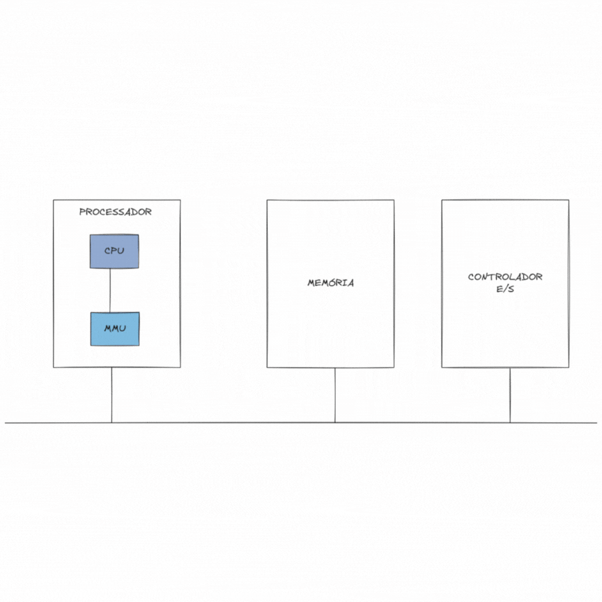
    <figcaption>
      <p align="center"><b>Figura 5</b>Mapeamento de memória via MMU</p>
      <p align="center">Fonte: Elaboração Própria.</p>
    </figcaption>
  </figure>
</div>

A memória virtual é uma técnica utilizada para gerenciamento de memória nos computadores. Nela, cada programa possui seu próprio espaço de endereçamento o qual é mapeado na memória física. Quando o programa referencia uma parte do espaço de endereçamento que está na memória física, o hardware encarrega-se de realizar rapidamente o mapeamento (tradução). 
Para realizar o mapeamento do endereço físico da porta KEY, foram utilizadas as funções <code>mmap()</code> e <code>unmap()</code> e o arquivo <code>/dev/mem</code> (arquivo do Linux que contém um espelho da memória do computador). A partir do endereço virtual gerado, pode-se acessar o registrador <i>edgecapture</i>.
</div>

<h4>Porta USB <i>host</i> e Mouse USB</h4>
<div align="justify">
USB ou Barramento Serial Universal é um padrão de conexão que permite a anexação de ate 127 dispositivos sem a necessidade de reiniciar o dispositivo, sendo assim realizadas todas as configurações para funcionamento do dispositivo em tempo de execução. Ademais, o padrão USB também dispensa o uso de drivers, fazendo com que toda a configuração do dispositivo seja automática. A comunicação entre um dispositivo host(computador) e um periférico pode envolver a troca de ate três pacotes de dados, sendo o primeiro, enviado pelo host que informa dados como endereço do dispositivo de destino, tipo de transação, fluxo de dados, entre outros.

No caso da placa DE1-SoC os conectores USB estão ligados a um HUB controlador que se comunica diretamente com o HPS, assim, quem por fim gerencia as portas é o SO instalado e em execução na processador ARM da placa, o que facilita o desenvolvimento e utilização das mesmas.

Sendo a movimentação do jogador no tabuleiro realizada através do mouse conectada a porta USB, a obtenção dos dados do dispositivo gerenciado pela distribuição Linux embarcada segue os padrões definidos pelo sistema operacional. Segundo Tanenbaum (2016), em sistemas UNIX, arquivos especiais permitem que dispositivos de E/S se pareçam com arquivos, permitindo as mesmas chamadas para ler e escrever arquivos que são mantidos no diretório <i>/dev</i>. Desse modo, o arquivo correspondente ao mouse USB bem como seus dados são encontrados no caminho <i>/dev/input/event0</i> da placa. Este arquivo contém o instante do evento, seu tipo, código e valor. O padrão dos registros de dispositivos USB é definido na documentação da Linux Kernel Organization *incluir referencia* e apresentado na Figura 5. A struct em linguagem C foi aplicada na decodificação dos eventos do mouse.

<!--
Dessa maneira, as análises realizadas permitiram compreender os eventos e  Como o kernel usa um arquivo binário para realizar a comunicação com o dispositivo, utilizou-se das funções  para realizar a leitura do mesmo, assim sendo possível uma melhor exibição do arquivo assim sendo possível também entender melhor o que cada evento significava.

Na realização dessas analises se constatou outro fato, seria necessário definir um valor mínimo de aceleração, pois qualquer toque sutil no mouse já era capaz de gerar eventos de aceleração, o que tornaria instável a usabilidade do mesmo. Para tal ato utilizou-se de base o valor 3, sendo -3 para eventos no sentido oposto
 -->
 
</div>
<div align="center">
  <figure>  
    
    <figcaption>
      <p align="center"><b>Figura 5</b> - Struct em C de evento de entrada dos dispositivos via USB</p>
      <p align="center">Fonte: kernel.org</p>
    </figcaption>
  </figure>
</div>

<div align="justify">
Para a compreensão do arquivo binário de registros do mouse, as funções <code>fopen()</code> e <code>fread()</code> da bibloteca <i>stdio</i> foram empregadas. Sendo assim possível compreender a dinâmica dos eventos, seus tipos e especificações. A partir das análises realizadas, constatou-se que os dados do arquivos são sobrescritos a cada novo evento e alteração não acumulando um histórico.

Apos esse avanço, foi definido que os tipos de eventos desejados seriam os eventos de click e os eventos de aceleração, também chamado de movimentação explicados a seguir:
<ul>
  <li>Eventos de clique são registrados quando algum dos botões do mouse é pressionado ou solto, retornando 1 ou 0 respectivamente no campo de valor. Um evento de clique tem valor <code>type</code> igual a 2 e valor do <code>code</code> correspondente ao botão pressionado.</li>
  <li>Eventos de aceleração ocorrem quando há a movimentação do mouse sobre alguma superfície, retornando, então, um  código correspondente ao eixo de movimentação, o sentido, esqueda, direita, cima, baixo, e o módulo correspondente ao deslocamento relativo do mouse. A figura 6 escreve o funcionamento do mouse com relação a eventos de aceleração, sendo a seta o sentido do movimento e as variáveis <code>ACL_X</code> e <code>ACL_Y</code> a aceleração positiva ou negativa nos eixos X e Y respectivamente. Por exemplo, ao movimentar o mouse da direita para a esquerda será retornado uma struct correspondente a um evento com tipo igual a 2, indicando o movimento do dispositivo, código igual 0 para o eixo X e valor negativo para o sentido do deslocamento. Tais dados compõe o deslocamento relativo do mouse capturado pelo seu sensor optico mediante o feixe de luz emitido pelo LED embutido no mouse.</li> 
</ul> 

Além disso, durante o desenvolvimento, foi adotado um valor mínimo de aceleração igual a 3, de modo a ignorar a leitura de toques muito sutis capazes de prejudicar a experiência do jogador. Também, foi notado que ao realizar a leitura de um evento o sinal é perpetuado por alguns instantes, fazendo com que a leitura do evento seja replicada por um determinado período de tempo. Para solucionar esse problema utilizou-se um contador, incrementado em 1 a cada evento lido, que retorna o evento de movimentação, bem como seus dados de módulo, direção e sentido quando o contador chega a 7. 

<!--Foi adicionado a biblioteca outras 2 funções, uma que realiza a abertura do arquivo do mouse e uma que realiza o do mesmo fechamento.-->


<div align="center">
  <figure>  
    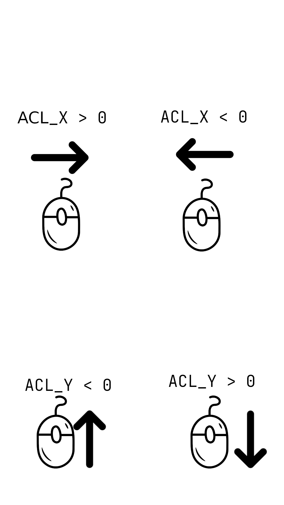
    <figcaption>
      <p align="center"><b>Figura 6</b>- Relação evento de movimentação</p>
      <p align="center">Fonte: Elaboração Própria.</p>
    </figcaption>
  </figure>
</div>


</div>

<h2>O Jogo</h2>
<div align="justify">
<i>Tic tac toe</i>, ou jogo da velha, é um jogo atemporal e de fácil entendimento. O jogo consiste em dois jogadores que, de forma alternada, desenham símbolos ('x' ou 'o') em uma matriz 3x3. Durante a partida, um quadrante ocupado não pode ser selecionado. Vence o jogo o player que conseguir formar primeiro uma linha - seja na horizontal, vertical ou diagonal - com o seu símbolo. Caso todas as casas tenham sido preenchidas sem que nenhum jogador forme uma linha, o jogo finaliza em empate ('velha' ou 'draw').
</div>
<h3>Jogabilidade</h3>
<div align="justify">
O controle do fluxo do jogo é dado por meio dos botões KEY0, KEY1 e KEY2 da placa DE1-SoC. Por meio desses, os jogadores podem selecionar entre os modos <i>single player</i> (jogador vs computador) e <i>dual player</i> (jogador 1 vs jogador 2), encerrar uma partida antes da sua conclusão, ou ainda finalizar a execução do jogo.

A seleção de um espaço vazio no tabuleiro, bem como a confirmação da jogada, dá-se por meio do mouse USB conectado ao kit de desenvolvimento. O usuário pode navegar pelos espaços do tabuleiro por meio da movimentação do mouse nas direções horizontal ou vertical, como ilustrado na figura abaixo. Ao chegar no quadrante em que deseja inserir o seu símbolo, o jogador pode confirmar a sua jogada por meio do botão esquerdo do mouse.
</div>
<div align="center">
  <figure>  
    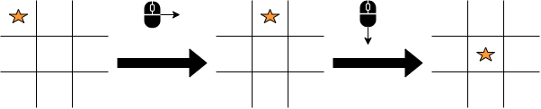
    <figcaption>
      <p align="center"><b>Figura 7</b>- Ilustração da seleção de um quadrante</p>
      <p align="center">Fonte: Elaboração Própria.</p>
    </figcaption>
  </figure>
</div>
<h3>O Tabuleiro</h3>
<div align="justify">
Para o tabuleiro, uma matrix 3x3 é implementada enquanto o usuário tem acesso a uma interface
No momento do desenvolvimento da logica do jogo foi notado que seria necessário fazer uma camada que convertesse as leituras do mouse pra ações e coordenadas validas dentro do jogo, por esse motivo foi implementado um modulo de interface de comunicação entre o mouse e o jogo.
O modulo da interface recebe do mouse a realização de eventos e, enquanto não for realizada a leitura de um evento valido o interface fica solicitando a entrada de um novo evento pelo mouse, no momento que um evento valido é detectado ele é realizada a identificação se é um evento de movimento ou um evento de clique.
Caso o evento seja de movimentação é realizada a chamada de uma função que verifica se, em um tabuleiro 3x3 e na posição que o cursor se encontra no momento, aquele movimento é valido, caso seja realiza a alteração da coordenada do cursor em decorrência do tipo de movimento, incrementando ou decrementando um nos eixos x e y, e atribui essa nova posição ao vetor de retorno, entretanto, caso o movimento seja valido, mas não seja possível de realizar no momento, é retornada as coordenadas atuais, sem realizar alterações.
Caso seja realizado um evento de clique, verifica qual botão foi pressionado e atribui ao vetor de retorno, na posição destinada para cliques, o valor do botão.
</div>
<div align="center">
  <figure>  
    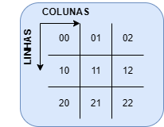
    <figcaption>
      <p align="center"><b>Figura 8</b>- Relação evento do mouse x quadrante do tabuleiro</p>
      <p align="center">Fonte: Elaboração Própria.</p>
    </figcaption>
  </figure>
</div>

<div align="center">
  <figure>  
    
    <figcaption>
      <p align="center"><b>Figura 9</b>- Movimento físico do mouse</p>
      <p align="center">Fonte: Elaboração Própria. </p>
    </figcaption>
  </figure>
</div>
<div align="center">
  <figure>  
    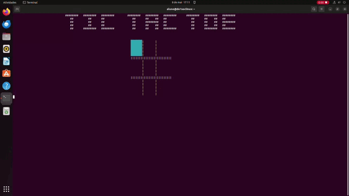
    <figcaption>
      <p align="center"><b>Figura 10</b>- Movimentação do cursor de acordo com o mouse</p>
      <p align="center">Fonte: Elaboração Própria. </p>
    </figcaption>
  </figure>
</div>

<h3>Interface do Usuário</h3>

<div align="justify">
A seguir, a interface visível ao jogador e os cenários do jogo.

Na tela de menu principal o usuário tem o título, uma breve descrição de como jogar e as opções selecionadas através do acionamento de cada KEY especificada. O jogador pode iniciar uma partida dual player (KEY1), single player (KEY2) ou sair do jogo (KEY3).
<div align="center">
  <figure>  
    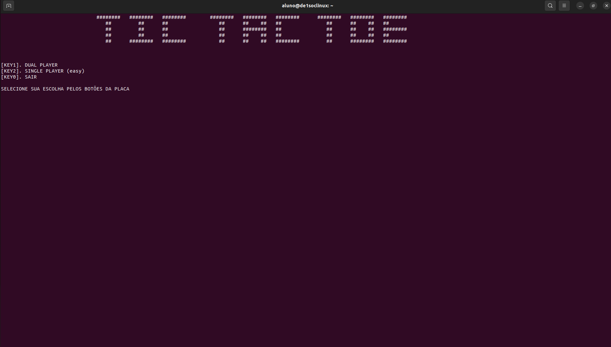
    <figcaption>
      <p align="center"><b>Figura 11</b>- Menu da tela inicial</p>
      <p align="center">Fonte: Elaboração Própria. </p>
    </figcaption>
  </figure>
</div>
Após o acionamento dos botões KEY1 ou KEY2, o tabuleiro do jogo é exibido na tela e é dado inicio à partida.
<div align="center">
    <figure>  
      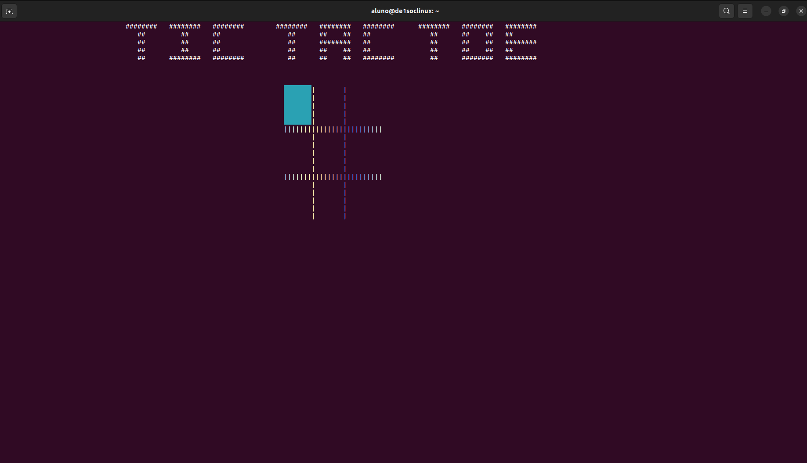
      <figcaption>
        <p align="center"><b>Figura </b>- Tabuleiro do jogo</p>
        <p align="center">Fonte: Elaboração Própria.</p>
      </figcaption>
    </figure>
  </div>
Caso seja pressionado a KEY1, será iniciado o jogo no modo dual player, onde retângulo ciano descreve a posição em que esta o cursor do mouse e o clique confirma a seleção do quadrante na vez de cada jogador.
<div align="center">
  <figure>  
    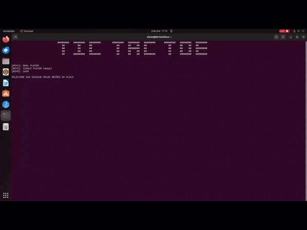
    <figcaption>
      <p align="center"><b>Figura 12</b>- Partida no Modo Dual Player</p>
      <p align="center">Fonte: Elaboração Própria.</p>
    </figcaption>
  </figure>
</div>

Caso seja pressionado a KEY2, será inciado o jogo no modo single player onde o jogador irá jogar com o símbolo círculo e o computador com X. Assim, o computador inicia jogando e logo após isso é a vez do jogador, representando pelo retângulo de cor ciano.
<div align="center">
  <figure>  
    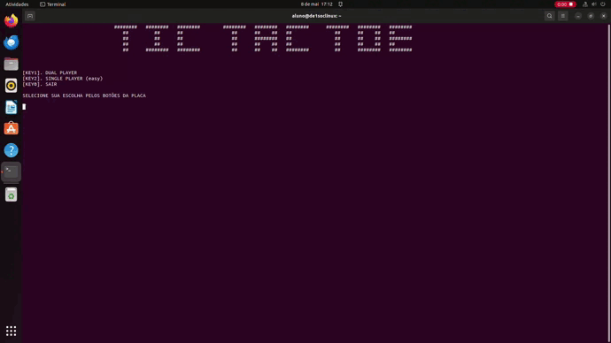
    <figcaption>
      <p align="center"><b>Figura 13</b>- Partida no Modo Single Player</p>
      <p align="center">Fonte: Elaboração Própria.</p>
    </figcaption>
  </figure>
</div>

Caso seja pressionado a KEY0 durante uma partida, esta será finalizada imediatamente e o jogo retorna ao menu principal. Quando acionado no menu principal o jogo é encerrado.

<div align="center">
  <figure>  
    
    <figcaption>
      <p align="center"><b>Figura 14</b>- Acionamento do botão (KEY0) para encerramento da partida</p>
      <p align="center">Fonte: Elaboração Própria.</p>
    </figcaption>
  </figure>
</div>
<div align="center">
  <figure>  
    
    <figcaption>
      <p align="center"><b>Figura 15</b>- Encerramento da partida através do botão KEY0</p>
      <p align="center">Fonte: Elaboração Própria.</p>
    </figcaption>
  </figure>
</div>

Caso um dos jogadores ganhe sera exibido o jogador que ganhou e após 5 segundos o jogador será redirecionado ao menu principal.
<div align="center">
  <figure>  
    
    <figcaption>
      <p align="center"><b>Figura 16</b>- Vitória do Jogador 1</p>
      <p align="center">Fonte: Elaboração Própria.</p>
    </figcaption>
  </figure>
</div>

Caso o computador ganhe sera exibida a mensagem que o computador ganhou e logo após isso o usuário será retornado ao menu principal.
*Gravar vitoria Computador*


Caso ocorra um empate, ou seja, caso não haja mais casas disponíveis para novas jogadas e nenhum dos jogadores tenham vencido, será exibido uma mensagem avisando que houve um empate e o jogador será redirecionado para o menu principal.

<div align="center">
  <figure>  
    
    <figcaption>
      <p align="center"><b>Figura 18</b>- Partida finalizada com empate</p>
      <p align="center">Fonte: Elaboração Própria.</p>
    </figcaption>
  </figure>
</div>
</div>

<h3>Algoritmos do jogo </h3>

<!--
will synchronize the positions and state of the objects in the world with the Render Thread, which will do all of the rendering logic and make sure to display them.
-->
<!--Ta perfeito, só faltou um "não" depois de Houve solicitação de finalização-->
A implementação do projeto exige a integração de 2 módulos principais: a rotina do jogo, incluindo o menu inicial, a checagem a matriz do tabuleiro em busca de combinações de símbolos para a condição de vitória, entre outras atividade e a captura e tradução do movimento do mouse no tabuleiro. Como decisão de projeto para maior eficiência da CPU e menor tempo de ociosidade aguardando entradas dos dispositivos E/S, o sistema ganha em eficiência operando com duas threads. Chamados por Tanenbaum (2016) de miniprocessos, as threads compartilham um conjunto de recursos de maneira que possam trabalhar juntos intimamente para desempenhar alguma tarefa, precisamente a interação desejada entre os módulos.
Além disso, tais processos rotineiramente acessam o mesmo espaço de memória, seja para ler ou escrever dados a exemplo da atualização da posição após o evento do mouse e a leitura da posição para checagem de posição livre para a jogada. Quando um ou mais processos manipulam dados compartilhados, o resultado final da variável varia a depender da ordem de execução entre eles. Diante de tal condição de corrida, variáveis compartilhadas para gerenciar a exclusão mútua (mutexes) foram implementadas, garantindo que apenas um processo tenha acesso a um dado compartilhado por vez.
<div align="center">
  <figure>  
    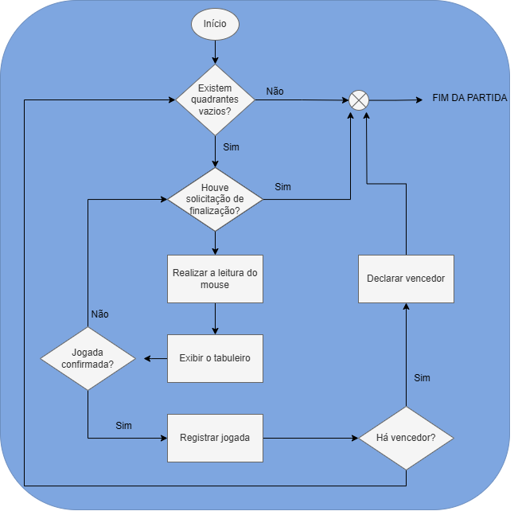
    <figcaption>
      <p align="center"><b>Figura 19</b>- Fluxograma do algoritmo da partida</p>
      <p align="center">Fonte: Elaboração Própria.</p>
    </figcaption>
  </figure>
</div>


<h2>Solução Geral</h2>

<h2>Testes Realizados</h2>
Os testes realizados para garantir o correto funcionamento do jogo são apresentados abaixo.
<ul>
  <li>Iniciar: Transição do menu para a tela da partida a partir do acionamento das KEY1 OU KEY2</li>
  <div align="center">
    <figure>  
      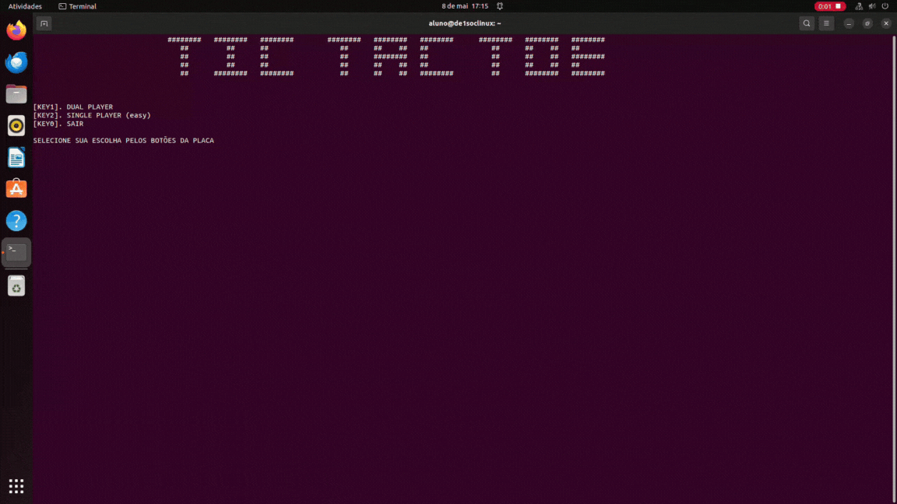
      <figcaption>
        <p align="center"><b>Figura </b>- Transição do menu para a tela da partida</p>
        <p align="center">Fonte: Elaboração Própria.</p>
      </figcaption>
    </figure>
  </div>
  <li>Movimentação durante a partida: Seleção de Quadrante após o primeiro jogador</li>
  <div align="center">
    <figure>  
      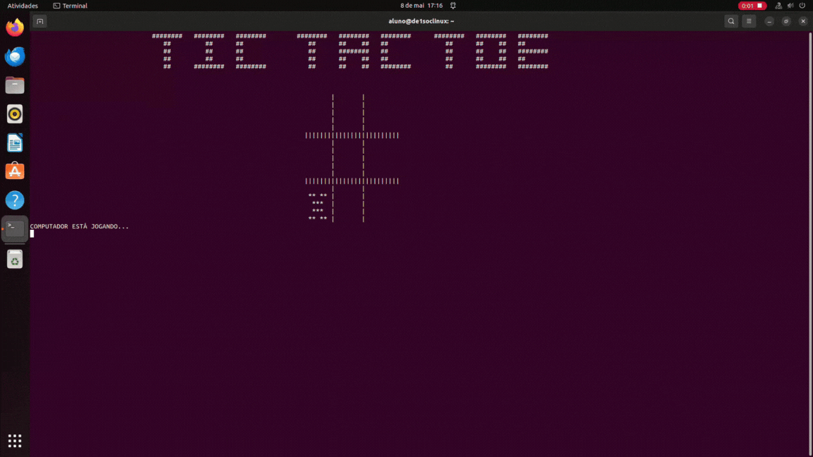
      <figcaption>
        <p align="center"><b>Figura </b>- Movimentação durante a partida</p>
        <p align="center">Fonte: Elaboração Própria.</p>
      </figcaption>
    </figure>
  </div>
  <li>Confirmação de jogada com Símbolo X. Click do mouse para confirmação da jogada com símbolo X no quadrante selecionado do tabuleiro.</li>
  <div align="center">
    <figure>  
      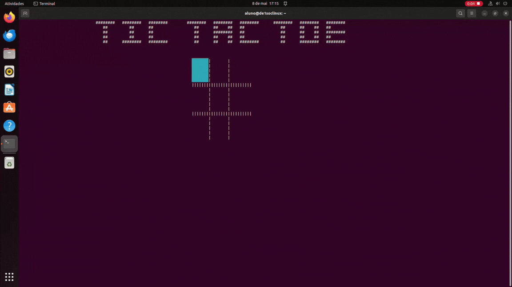
      <figcaption>
        <p align="center"><b>Figura </b>- Confirmação de jogada X atravé do mouse</p>
        <p align="center">Fonte: Elaboração Própria.</p>
      </figcaption>
    </figure>
  </div>
  <li>Confirmação de jogada com Símbolo 0. Click do mouse para confirmação da jogada com símbolo 0 no quadrante selecionado do tabuleiro</li>
  <div align="center">
    <figure>  
      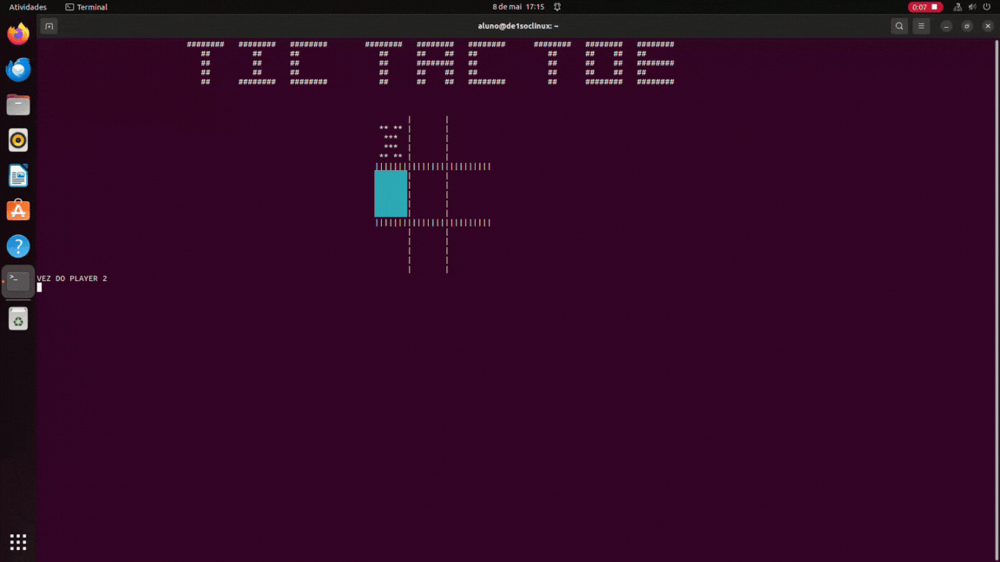
      <figcaption>
        <p align="center"><b>Figura </b>- Confirmação de jogada 0 através do mouse</p>
        <p align="center">Fonte: Elaboração Própria.</p>
      </figcaption>
    </figure>
  </div>
  <li>Vitória na Vertical: Conjunto de 3 símbolos iguais na vertical.</li>
  <div align="center">
  <figure>  
    
    <figcaption>
      <p align="center"><b>Figura </b>- Vitória do 0 na Vertical</p>
      <p align="center">Fonte: Elaboração Própria.</p>
    </figcaption>
  </figure>
</div>
  <li>Vitória na Horizontal: Conjunto de 3 símbolos iguais na horizontal.</li>
  <div align="center">
    <figure>  
      
      <figcaption>
        <p align="center"><b>Figura </b>- Vitória do 0 na Horizontal</p>
        <p align="center">Fonte: Elaboração Própria.</p>
      </figcaption>
    </figure>
  </div>
  <li>Vitória na Diagonal: Conjunto de 3 símbolos iguais na diagonal.</li>
  <div align="center">
  <figure>  
    
    <figcaption>
      <p align="center"><b>Figura </b>- Vitória do X na Diagonal</p>
      <p align="center">Fonte: Elaboração Própria.</p>
    </figcaption>
  </figure>
</div>
  <li>Vitória do Computador</li>
  <li>Empate: deu Velha ou Draw. Nenhum dos jogadores completa uma trilha de símbolos iguais.</li>
  <div align="center">
  <figure>  
    
    <figcaption>
      <p align="center"><b>Figura </b>- Empate: deu velha</p>
      <p align="center">Fonte: Elaboração Própria.</p>
    </figcaption>
  </figure>
</div>
  <li>Interrupção do Jogo durante a partida</li>
  <div align="center">
    <figure>  
      
      <figcaption>
        <p align="center"><b>Figura </b>- Transição do menu para a tela da partida</p>
        <p align="center">Fonte: Elaboração Própria.</p>
      </figcaption>
    </figure>
  </div>
  <li>Sair do Jogo no Menu</li>
</ul>

<h2>Conclusão</h2>
<div align="justify">
O desenvolvimento do clássico jogo <i>Tic-Tac-Toe</i> em linguagem C no kit de desenvolvimento DE1-Soc se mostrou desafiadora, porém gratificante como primeiro projeto de sistemas digitais. Todos os requisitos foram atendidos utilizando as interfaces disponíveis na placa DE1-SoC e as políticas de gerenciamento de sistema operacional Linux em arquitetura ARM para a criação de soluções e implementação do jogo. A funcionalidade e eficiência do sistema foi evidenciada nos testes, que confirmaram a consistência do jogo nos diferentes modos e condições.

Além de compreender os princípio básicos da arquitetura da plataforma DE1-SoC, este projeto proporcionou o aprofundamento e prática em uma distribuição Linux embarcada e dos conceitos de interação entre hardware e software.
</div>

<h2>Descrição de instalação, configuração de ambiente e execução</h2>

<div align="justify">

A seguir estão listados os passos necessários para a execução do jogo em outro dispositivo FPGA DE1-SoC 

<h3>Requisitos:</h3>
<ul>
<li>Possuir conexão com internet;<br></li>
<li>Possuir o compilador gcc;<br></li>
<li>Possuir o git instalado;<br></li>
<li>Estar utilizando uma placa de desenvolvimento FPGA DE1-SoC;<br></li>
<li>Possuir um mouse conectado a placa;<br></li>
</ul>
Caso todos os requisitos anteriores sejam satisfeitos basta seguir o passo a passo

<h3>1: clonar o repositorio</h3>

abra o terminal do seu dispositivo e execute o seguinte comando
 ```
git clone https://github.com/brendabo1/Sistema-Digital-TicTacToe.git
```

<h3>2: acessar a pasta source e compilar o codigo com o gcc</h3>

para acessar a pasta source basta execultar o seguinte comando
```
cd source/
```
<h3>3: compilar o codigo</h3>
execulte o seguinte comando para realizar a compilação do projeto

```
make all
```
<h3>4: execute o jogo</h3>
para execultar o jogo basta execultar o seguinte comando

```
sudo ./tic-tac-toe
```
</div>

<h2>Referências</h2>

IASBIK, M. P. Tic Tac Toe: O Jogo da Velha que Encanta Gerações. Disponível em: <https://www.gadoo.com.br/dicas/tic-tac-toe/>. Acesso em: 6 maio. 2024.

Intel® FPGA University Program DE1-SoC Computer Manual. <https://ftp.intel.com/Public/Pub/fpgaup/pub/Intel_Material/18.1/Computer_Systems/DE1-SoC/DE1-SoC_Computer_ARM.pdf>. Acesso em: 22 abril. 2024.

Intel® FPGA University Program DE1-SoC Computer System with ARM* Cortex* A9. Disponível em: <https://fpgacademy.org/courses.html>. Acesso em: 24 abril. 2024.

GCC online documentation - GNU Project. Disponível em: <https://gcc.gnu.org/onlinedocs/>. Acesso em: 7 maio. 2024.

Linux Input Subsystem userspace API — The Linux Kernel documentation. Disponível em: <https://www.kernel.org/doc/html/latest/input/input_uapi.html>. Acesso em: 7 maio. 2024.

MARTINS, Luiz. Apostila de Linguagem C (Conceitos Básicos), Virtual Books. Disponível em: <https://www.facom.ufu.br/~gustavo/ED1/Apostila_Linguagem_C.pdf>. Acesso em: 22 abril. 2024.

TANENBAUM, A. S.; BOS, Herbert. Sistemas operacionais modernos. 4. ed. São Paulo: Pearson Education do Brasil, 2016. Acesso em: 2 maio. 2024.

Terasic Techologies Inc. DE1-Soc User Manual. Disponível em: <https://www.terasic.com.tw/cgi-bin/page/archive.pl?Language=English&No=836&PartNo=4>. Acesso em: 20 abril. 2024.

The Linux Kernel documentation — The Linux Kernel documentation. Disponível em: <https://www.kernel.org/doc/html/latest/>. Acesso em: 18 abril. 2024.

Universal Serial Bus. Disponível em: <https://www.gta.ufrj.br/grad/01_1/usb/usb.htm#%C2%A7%201.1%20%E2%80%93%20Objetivos%20de%20desenvolvimento%20do%20USB>. Acesso em: 8 maio. 2024.
<!--
http://uab.ifsul.edu.br/tsiad/conteudo/modulo1/hco/hco_ua/mouse.pdf  fala sobre o mouse e funcionamento do mesmo
-->
