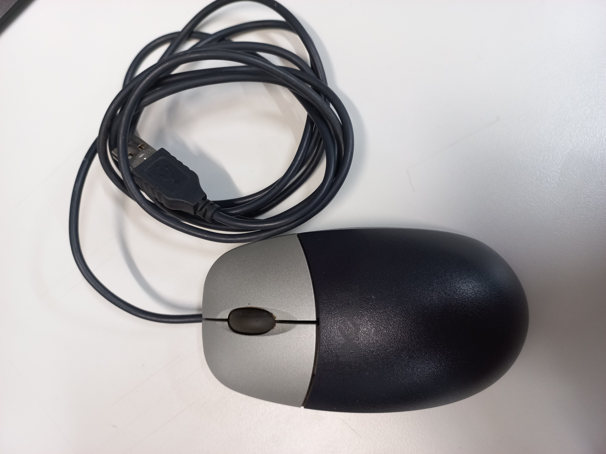
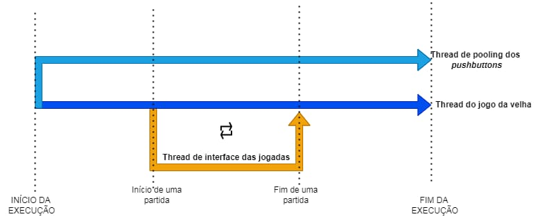
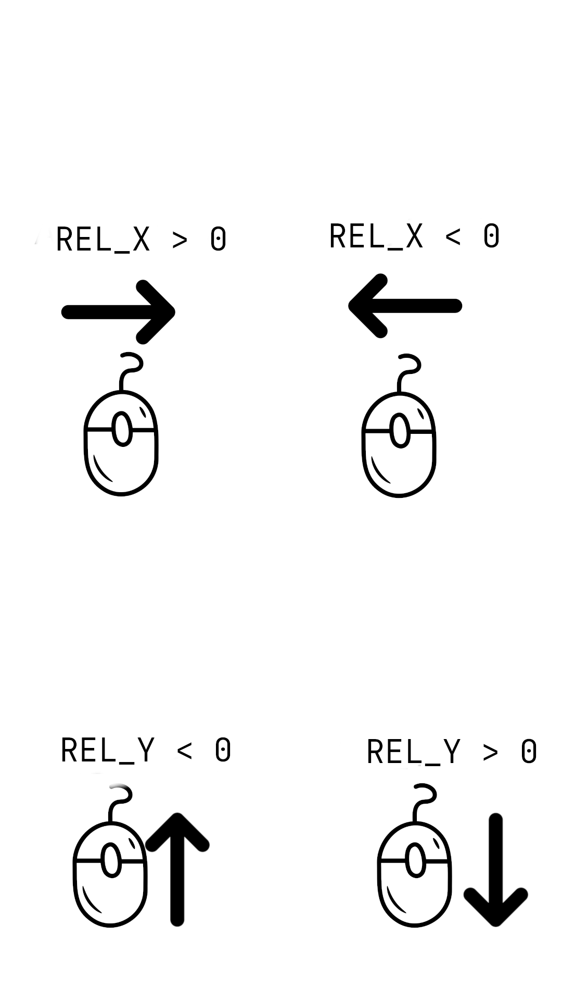
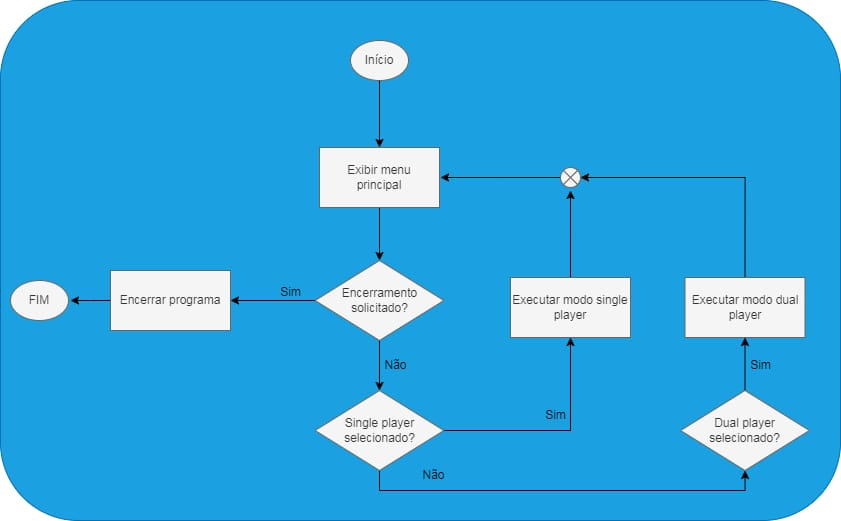
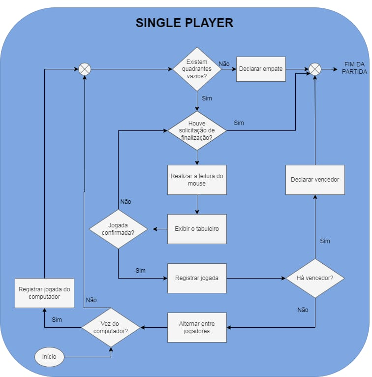
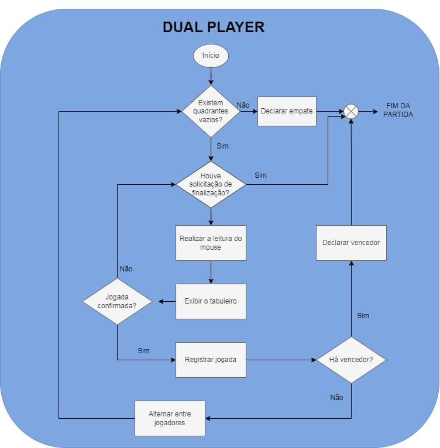

<h1 align="center"><i>Tic Tac Toe</i></h1>

<p align="center">Projeto de console dedicado para o Kit de desenvolvimento DE1-SoC</p>

  

<h2>Introdução</h2>
<p align="justify">Nos últimos anos, os jogos digitais emergiram como uma forma de entretenimento profundamente influente e culturalmente significativa. Desde os primórdios dos jogos de computador e consoles de videogame até a era contemporânea dos jogos móveis e realidade virtual, a indústria de jogos digitais tem evoluído constantemente. Contudo, é importante o papel dos jogos digitais clássicos, que representam os pilares fundamentais da indústria, transcendendo fronteiras geográficas e geracionais.</p>
<p align="justify">Esses clássicos não apenas resistiram ao teste do tempo, mas também continuam a ser celebrados como marcos históricos que ajudaram a moldar o meio dos jogos digitais como o conhecemos hoje. Um desses emblemáticos passatempos é o conhecido Jogo Da Velha ou <i>Tic-Tac-Toe</i> que, apesar da sua origem remontar há mais de 3.500 anos no antigo Egito e da sua dinâmica simples, é um dos jogos mais populares do mundo.</p>
<p align="justify">Neste contexto, o presente projeto objetiva o desenvolvimento de um console que implemente uma versão do clássico Jogo Da Velha em uma plataforma de desenvolvimento de hardware. O Kit de desenvolvimento DE1-SoC foi selecionado  para a execução do sistema. As soluções, softwares e dispositivos utilizados no desenvolvimento serão abordados nas seções subsequentes.</p>
<h3>Requisitos</h3>
A solução deve atender às condições e aos requisitos predeterminados, de modo que o jogo deve:
<ul>
  <li>Ser executado em uma interface em modo texto, que possa ser visualizada via terminal;</li>
  <li>Permitir a interação de dois jogadores;</li>
  <li>Captar a posição de marcação da jogada no tabuleiro, assim como a confirmação da ação, por meio de um mouse conectado a uma das portas USB da placa;</li>
  <li>Utilizar os botões e chaves disponíveis na placa para o controle do fluxo do jogo.</li>
  <li>Ter seu código escrito em linguagem C;</li>
  <li>Utilizar exclusivamente os componentes disponíveis na placa DE1-SoC.</li>
</ul>
<h2>Equipe</h2>
<ul>
  <li>Brenda Barbosa</li>
  <li>Camila Queiroz</li>
  <li>Maike de Oliveira</li>
</ul>
<h2>Softwares Utilizados</h2>
Nessa seção são apresentados os softwares que auxiliaram no desenvolvimento do sistema.
<h3>Linguagem C</h3>
<p align="justify">É uma linguagem de programação de propósito geral que combina abstrações e controles de baixo nível sobre o hardware resultando em ganho de eficiência. O software criado em 1970 por Dennis Ritchie é estreitamente associada ao sistema operacional UNIX, uma vez que as versões desse sistema foram escritas em linguagem C. Além disso, a sintaxe simples e a alta portabilidade desta linguagem entre dispositivos contribui para seu amplo uso em sistemas embarcados de recursos limitados.</p>
<h3>Compilador GNU</h3>
<p align="justify">O <i>GNU Compiler Collection GCC</i> (Coleção de Compiladores GNU), ou GCC, é um conjunto de compiladores de código aberto desenvolvido pelo Projeto GNU que oferecem suporte a uma gama de linguagens de programação, incluindo C, C++, Fortran, Ada e Go. Esta ferramenta otimiza a compilação, ou seja a produção de código de máquina, nas várias linguagens e arquiteturas de processadores suportadas.</p>
<h3>VS Code</h3>
<p align="justify">O Visual Studio Code, ou VS Code, é um editor de texto gratuito com suporte a várias linguagens de programação, incluindo Python, Java, C, C++ e JavaScript. A ferramenta desenvolvida pela Microsoft dispõe de diversos recursos de depuração, destaque de erros, sugestões, personalização dentre outros para auxiliar a codificação. Desse modo, o editor foi um dos ambientes utilizados no desenvolvimento do código fonte do jogo.</p>
<h3>Nano</h3>
<p align="justify">Também, o editor de texto simples Nano, na versão 2.2.6, presente no Linux embarcado do Kit de desenvolvimento DE1-SoC foi utilizado para codificação da solução. O Nano é um software leve e que oferece uma interface de linha de comando intuitiva, tornando-o ideal para rápida edição de arquivos, scripts e outros documentos de texto.</p>
<h2>Arquitetura do Computador Utilizado nos Testes</h2>
Nesta seção, exploraremos as principais características do Kit de desenvolvimento DE1-SoC.
<h3>O Kit de Desenvolvimento DE1-SoC</h3>
<p align="justify">Equipado com processador, USB, memória DDR3, Ethernet e uma gama de periféricos, o kit de desenvolvimento DE1-SoC (Figura 1) integra no mesmo Cyclone® V, sistema em chip (SoC), um <i>hard processor system</i> (HPS) a uma FPGA (<i>Field Programmable Gate Arrays</i>). Este design permite uma grande flexibilidade da placa nas mais variadas aplicações. Para o acesso ao sistema operacional Linux embarcado na placa, o protocolo de rede SSH <i>(Secure Shell)</i> foi utilizado, estabelecendo uma conexão criptografada para comunicação entre a placa e computador <i>host</i>.</p>
<div align="center">

  <figure>  

    

    <figcaption>

      <p align="center"><b>Figura 1</b> - Kit de Desenvolvimento DE1-SoC</p>

      <p align="center">Fonte: Terasic Technologies</p>

    </figcaption>

  </figure>

</div>

  

<h3>Sistema Computacional DE1-SoC</h3>

<div align="justify">O diagrama de blocos do sistema computacional, apresentado na figura 2,  explicita os componentes do Cyclone® V da Intel®, bem como suas conexões. O HPS inclui um processador ARM® Cortex-A9 MPCore™ de 2 núcleos com uma distribuição Linux embarcada destinada a processamentos de propósito geral,  além da memória DDR3 e dos dispositivos periféricos. Já a FPGA possibilita uma variedade de implementações através da programação dos blocos lógicos.

A comunicação bidirecional entre a o HPS e a FPGA se dá por meio das <i>FPGA bridges</i> presentes no dispositivo. Assim, no sentido HPS-FPGA, todos os dispositivos de entrada e saída (E/S) conectados à FPGA são acessíveis ao processador através do mapeamento de memória. As informações sobre o endereçamento dos periféricos estão disponíveis na documentação da placa (FPGAcademy.org).</div>
<div align="center">
  <figure>  
    
    <figcaption>
      <p align="center"><b>Figura 2</b> - Diagrama de Blocos da DE1-SoC</p>
      <p align="center">Fonte: FPGAcademy.org</p>
    </figcaption>
  </figure>
</div>
<h2>Periféricos utilizados no projeto</h2>
<p align="justify">Como indicado na seção anterior, o kit de desenvolvimento DE1-SoC possui diversos periféricos integrados. Para este projeto, os componentes selecionados foram os botões do tipo <i>push</i> e as portas USB <i>host</i>, ambos destacados na figura 3. Associado a estes dispositivos, utilizou-se também um mouse USB.</p>

<div align="center">
  <figure>  
    
    <figcaption>
      <p align="center"><b>Figura 3</b> - Periféricos da placa DE1-SoC (adaptado)</p>
      <p align="center">Fonte: FPGAcademy.org</p>
    </figcaption>
  </figure>
</div>
<h3> Botões do tipo <i>push</i></h3>
<p align="justify">A placa utilizada disponibiliza para o usuário quatro botões do tipo <i>push</i> (integrados à FPGA), os quais possuem três registradores com funções diversificadas. São eles o registrador de dados, o registrador <i>maskinterrupt</i> e o registrador <i>edgecapture</i>, todos ilustrados na figura 4. </p>

<div align="center">
  <figure>  
    
    <figcaption>
      <p align="center"><b>Figura 4</b> - Porta paralela KEY (adaptado)</p>
      <p align="center">Fonte: FPGAcademy.org</p>
    </figcaption>
  </figure>
</div>
<div align="justify">

O registrador de dados é utilizado para identificar quais botões estão pressionados em um determinado instante.  Quando um botão é pressionado, seu bit correspondente no registrador é setado com o valor 1. Quando liberado, o bit é setado para 0.

Por sua vez, o <i>edgecapture</i> é utilizado para identificar se um botão foi pressionado desde a última checagem (mesmo que tenha sido liberado). Quando um botão é pressionado, seu bit correspondente no registrador é setado para 1. O valor permanece até que o bit seja limpo (escrever explicitamente o valor 1).

Por fim, o registrador <i>interruptmask</i> é utilizado para manipular as interrupções enviadas ao processador ARM por meio dos botões. Para habilitar as interrupções para um determinado botão, basta setar para 1 no registrador o bit correspondente ao botão.</div>

<h3> Portas USB <i>host</i> e mouse USB</h3>
<div align="justify">Barramento Serial Universal, ou USB, é um padrão de conexão que permite a anexação de até 127 dispositivos sem a necessidade de reiniciar o computador, sendo assim realizadas todas as configurações para funcionamento do dispositivo em tempo de execução. Ademais, o padrão USB também dispensa o uso de drivers, fazendo com que toda a configuração do dispositivo seja automática. A comunicação entre um dispositivo <i>host</i> (computador) e um periférico pode envolver a troca de ate três pacotes de dados, sendo o primeiro, enviado pelo host que informa dados como endereço do dispositivo de destino, tipo de transação, fluxo de dados, entre outros.

Na placa DE1-SoC, os conectores USB estão ligados a um HUB controlador que se comunica diretamente com o HPS. Assim, o sistema operacional instalado e em execução na processador ARM da placa é quem gerencia as portas. Esta organização facilita o desenvolvimento e utilização das mesmas. Neste projeto, utilizou-se um mouse (figura 5) conectado à porta USB <i>host</i> da placa.</div>

<div align="center">
  <figure>  
    
    <figcaption>
      <p align="center"><b>Figura 5</b> - Mouse USB utilizado</p>
      <p align="center">Fonte: Elaboração própria</p>
    </figcaption>
  </figure>
</div>
 
<h2>Solução Geral</h2>
<p align="justify">O produto final integra os módulos de <i>pooling</i> dos <i>pushbuttons</i> e do mouse USB com a lógica do jogo da velha implementada a fim de criar um aplicação que atenda aos requisitos propostos. A aplicação desenvolvida está esquematizada na figura 6.</p>
<div align="center">
  <figure>  
    
    <figcaption>
      <p align="center"><b>Figura 6 </b>- Esquema em blocos da solução geral</p>
      <p align="center">Fonte: Elaboração Própria.</p>
    </figcaption>
  </figure>
</div>
<div align="justify">Os módulos de <i>pooling</i> do mouse e dos botões realizam a captura dos eventos dos periféricos e a conversão dos mesmos para uma versão que o bloco do jogo possa utilizar. Por sua vez, o bloco jogo da velha utiliza as informações disponibilizadas pelos outros dois blocos para realizar o controle do fluxo de execução do jogo.

A fim de maximizar a eficiência da CPU e reduzir o tempo de ociosidade aguardando eventos dos dispositivos E/S, os blocos apresentados foram divididos em threads. Chamados por Tanenbaum (2016) de miniprocessos, as threads compartilham um conjunto de recursos, tal como o espaço de endereçamento, de maneira que possam trabalhar juntos intimamente para desempenhar alguma tarefa, precisamente a interação desejada entre os módulos. As threads implementadas e suas respectivas funções estão listadas abaixo:
<ul>
<li>thread de <i>pooling</i> dos <i>pushbuttons</i>: responsável pelo <i>pooling</i> dos botões, bem como a conversão dos dados dos eventos;</li>
<li>thread de interface de jogadas: responsável pelo <i>pooling</i> do mouse, conversão dos dados dos eventos e display do tabuleiro;</li>
<li>thread do jogo da velha: responsável pelo controle e display do menu e execução da lógica das partidas.</li>
</ul>
A relação entre as threads, bem como seus períodos de vida estão esquematizados na figura 7. Ambas as threads de <i>pooling</i> dos botões e do jogo da velha são inicializadas após o início da execução do programa e são destruídas antes da finalização de uma partida. Por sua vez, a thread de interface de jogadas é criada apenas cm a inicialização de uma partida e é destruída com a finalização da mesma.</div>

  

<div align="center">
  <figure>  
    
    <figcaption>
      <p align="center"><b>Figura 7 </b>- Fluxo de criação e destruição das threads</p>
      <p align="center">Fonte: Elaboração Própria.</p>
    </figcaption>
  </figure>
</div>
<div align="justify">Além disso, tais processos rotineiramente acessam o mesmo espaço de memória, seja para ler ou escrever dados. Quando um ou mais processos manipulam dados compartilhados, o resultado final da variável varia a depender da ordem de execução entre eles. Diante de tal condição de corrida, variáveis compartilhadas para gerenciar a exclusão mútua (mutexes) são implementadas, garantindo que apenas um processo tenha acesso a um dado compartilhado por vez (TANENBAUM, 2016). Neste sistema, mutexes foram implementados para gerenciar o acesso aos dados dos eventos fornecidos - posição do mouse e botões pressionados - à thread do jogo da velha</div>
<h2>Polling dos botões</h2>
<div align="justify">O banco de registradores dos botões (citado anteriormente) compõe a porta KEY. Esta porta está mapeada no espaço de endereçamento da ponte <code>lwhps2fpga</code> (Lightweight HPS-to-FPGA Bridge) a qual encarrega-se da conexão entre o FPGA e o HPS da placa. As portas E/S mapeadas nesta ponte podem ser acessadas por meio do endereço base (0xFF200000) somado ao <i>offset</i> da porta (para a porta KEY, <i>offset</i> = 0x00000050). Entretanto, para acessar os valores das portas mapeadas, faz-se necessária a virtualização destes endereços físicos.

A memória virtual é uma técnica utilizada para gerenciamento de memória nos computadores. Nela, cada programa possui seu próprio espaço de endereçamento o qual é mapeado na memória física. Quando o programa referencia uma parte do espaço de endereçamento que está na memória física, o hardware (MMU - <i>memory management unit</i>) encarrega-se de realizar rapidamente o mapeamento (tradução) (TANENBAUM, 2016). Este processo está esquematizado na figura 8.
</div>

<div align="center">
  <figure>  
    
    <figcaption>
      <p align="center"><b>Figura 8 </b>- Mapeamento de memória via MMU</p>
      <p align="center">Fonte: Elaboração Própria.</p>
    </figcaption>
  </figure>
</div>
<p align="justify">Para realizar o mapeamento do endereço físico da porta KEY, foram utilizadas as funções <code>mmap()</code> e <code>unmap()</code> e o arquivo <code>/dev/mem</code> (arquivo do Linux que contém um espelho da memória do computador). A partir do endereço virtual gerado, pode-se acessar o registrador <i>edgecapture</i>.</p>
<h2>Pooling do mouse USB</h2>
<div align="justify">A obtenção dos dados do mouse USB segue os padrões definidos pela distribuição Linux embarcada na placa. Segundo Tanenbaum (2016), em sistemas UNIX, arquivos especiais permitem que dispositivos de E/S se pareçam com arquivos, permitindo as mesmas chamadas de leitura e de escrita. Os arquivos referentes aos dispositivos gerenciados pelo SO são mantidos no diretório <code>/dev/input</code>. 

No kit de desenvolvimento, o arquivo correspondente aos eventos do mouse USB usado encontram-se no caminho <code>/dev/input/event0</code>. Este arquivo contém o instante do evento, seu tipo, código e valor. Este padrão de registro de eventos é definido pela interface <i>Input</i>, documentada na <i>Linux Kernel Organization</i> (https://kernel.org/doc/html/latest/input/input.html#event-interface), e apresentado na Figura 9. A struct em linguagem C foi aplicada na decodificação dos eventos do mouse. As informações neste arquivo são sobrescritas a cada novo evento, não acumulando um histórico.
Para a leitura do arquivo <i>event0</i> em binário, utilizou-se as funções <code>fopen()</code> e <code>fread()</code> da biblioteca <i>stdio</i>.
</div>

<div align="center">
  <figure>  
    
    <figcaption>
      <p align="center"><b>Figura 9</b> - Struct em C da interface do evento do dispositivo</p>
      <p align="center">Fonte: kernel.org</p>
    </figcaption>
  </figure>
</div>
<div align="justify">
  Os eventos considerados no projeto são apenas os eventos de clique e de movimentação relativa os quais são explicados abaixo:
<ul align="justify">
  <li>Eventos de clique são registrados quando algum dos botões do mouse é pressionado ou liberado e retornam 1 ou 0, respectivamente, no campo de valor. Um evento de clique tem valor <code>type</code> igual a 2 e valor do <code>code</code> correspondente ao botão pressionado.</li>

  <li>Eventos de movimentação, ocorrem quando há o deslocamento do mouse sobre alguma superfície, retornando, então, um código correspondente ao eixo de movimentação, o sentido -esquerda, direita, cima, baixo - e o módulo correspondente ao deslocamento relativo do mouse. A figura 10 ilustra o funcionamento do mouse com relação a eventos de deslocamento, sendo a seta o sentido do movimento e as variáveis <code>REL_X</code> e <code>REL_Y</code> a velocidade, positiva ou negativa, nos eixos X e Y, respectivamente. Por exemplo, ao movimentar o mouse da direita para a esquerda, obtem-se uma struct correspondente a um evento com tipo igual a 2, indicando o movimento do dispositivo, código igual 0 para o eixo X e valor negativo para o sentido do deslocamento. Tais dados compõem o deslocamento relativo do mouse capturado pelo seu sensor óptico mediante o feixe de luz emitido pelo LED embutido no mouse.</li>
</ul>

Adotou-se o valor mínimo de velocidade igual a 3, a fim de controlar a sensibilidade do mouse e melhorar a experiência do usuário. Além disso, um contador, incrementado em 1 a cada evento lido e que retorna os dados do evento quando a contagem chega a 7, foi usado para solucionar o problema observado de replicação de eventos por um curto período de tempo.
<!--Foi adicionado a biblioteca outras 2 funções, uma que realiza a abertura do arquivo do mouse e uma que realiza o do mesmo fechamento.-->
<div align="center">
  <figure>  
    
    <figcaption>
      <p align="center"><b>Figura 10 </b>- Relação evento de movimentação</p>
      <p align="center">Fonte: Elaboração Própria.</p>
    </figcaption>
  </figure>
</div>
</div>
<h2> O jogo</h2>
<p align="justify">O jogo da velha consiste em dois jogadores que, de forma alternada, desenham símbolos ('x' ou 'o') em uma matriz 3x3. Durante a partida, um quadrante ocupado não pode ser selecionado. Vence o jogo o player que conseguir formar primeiro uma linha - seja na horizontal, vertical ou diagonal - com o seu símbolo. Caso todas as casas tenham sido preenchidas sem que nenhum jogador forme uma linha, o jogo finaliza em empate ('velha' ).</p>
<h3>Jogabilidade</h3>
<div align="justify">
O controle do fluxo do jogo é dado por meio dos botões KEY0, KEY1 e KEY2 da placa DE1-SoC. Por meio desses, os jogadores podem selecionar entre os modos <i>single player</i> (jogador vs computador) e <i>dual player</i> (jogador 1 vs jogador 2), encerrar uma partida antes da sua conclusão, ou ainda finalizar a execução do jogo.  

A seleção de um espaço vazio no tabuleiro, bem como a confirmação da jogada, dá-se por meio do mouse USB conectado ao kit de desenvolvimento. O usuário pode navegar pelos espaços do tabuleiro por meio da movimentação do mouse nas direções horizontal ou vertical, como ilustrado pelas figuras 11, 12 e 13. Ao chegar no quadrante em que deseja inserir o seu símbolo, o jogador pode confirmar a sua jogada por meio do botão esquerdo do mouse.</div>

<div align="center">
  <figure>  
    
    <figcaption>
      <p align="center"><b>Figura 11 </b>- Ilustração da seleção de um quadrante</p>
      <p align="center">Fonte: Elaboração Própria.</p>
    </figcaption>
  </figure>
</div>
<div align="center">
  <figure>  
    
    <figcaption>
      <p align="center"><b>Figura 12 </b>- Movimento físico do mouse</p>
      <p align="center">Fonte: Elaboração Própria. </p>
    </figcaption>
  </figure>
</div>

<div align="center">
  <figure>  
    
    <figcaption>
      <p align="center"><b>Figura 13 </b>- Movimentação do cursor de acordo com o mouse</p>
      <p align="center">Fonte: Elaboração Própria. </p>
    </figcaption>
  </figure>
</div>
<h3>Algoritmos do jogo </h3>
<div align="justify">
Com a definição de diferentes modos de jogo, bem como das possibilidades de encerramento de partida e de execução do programa, fez-se necessária a organização de um fluxo de controle. O fluxo desenvolvido e implementado em linguagem C está esquematizado na figura 14.
<div align="center">
  <figure>  
    
    <figcaption>
      <p align="center"><b>Figura 14</b>- Esquema do fluxo do jogo</p>
      <p align="center">Fonte: Elaboração Própria.</p>
    </figcaption>
  </figure>
</div>
Com o início do programa no menu principal, três seguimentos distintos podem ser selecionados: encerramento da execução,  modo de jogo <i>single player</i> ou modo de jogo <i>dual player</i>. Ambos os modos de jogo, levam ao início de uma partida, a qual pode ter seu fluxo finalizado normalmente (pela vitória ou empate), ou pela escolha do usuário. Em ambos os casos, o fluxo retorna ao menu inicial. Por fim, o encerramento da execução finaliza o programa.

Independente do modo de jogo selecionado pelo usuário, a execução de uma partida possui um fluxo básico. A partida iniciada permanece em execução até que uma solicitação de encerramento seja realizada ou uma vitória ou empate seja detectada. Ao longo do processo, o fluxo realiza ações de exibição do tabuleiro, registro de jogadas e verificações. A diferença entre os fluxos de partida dos modos <i>dual player</i> e <i>single player</i>, esquematizados nas figuras 15 e 16, respectivamente,  é que o último, ao identificar a vez do computador, realiza uma jogada aleatória gerada.
<div align="center">
  <figure>  
    
    <figcaption>
      <p align="center"><b>Figura 15 </b>- Fluxograma da partida no modo single player</p>
      <p align="center">Fonte: Elaboração Própria.</p>
    </figcaption>
  </figure>
</div>

<div align="center">
  <figure>  
    
    <figcaption>
      <p align="center"><b>Figura 16 </b>- Fluxograma da partida no modo dual player</p>
      <p align="center">Fonte: Elaboração Própria.</p>
    </figcaption>
  </figure>
</div>
</div>
<h2>Interface do Usuário</h2>
<div align="justify">
Nesta seção, a interface visível aos jogadores, bem como os cenários do jogo, são apresentados. 

Na tela de menu principal (figura 17), o usuário visualiza o título do jogo e as escolhas disponíveis do jogo: partida <i>dual player</i>, partida <i>single player</i> e sair do jogo.
<div align="center">
  <figure>  
    
    <figcaption>
      <p align="center"><b>Figura 17 </b>- Menu da tela inicial</p>
      <p align="center">Fonte: Elaboração Própria. </p>
    </figcaption>
  </figure>
</div>
Com a seleção de um modo de jogo, o tabuleiro é exibido na tela (figura 18) e é dado início à partida.

<div align="center">
    <figure>  
      
      <figcaption>
        <p align="center"><b>Figura 18 </b>- Tabuleiro do jogo</p>
        <p align="center">Fonte: Elaboração Própria.</p>
      </figcaption>
    </figure>
  </div>
Para o modo <i>dual player</i>, o retângulo ciano descreve a posição em que está o cursor do mouse e o clique confirma a seleção do quadrante na vez de cada jogador (figura 19).

<div align="center">
  <figure>  
    
    <figcaption>
      <p align="center"><b>Figura 19 </b>- Partida no Modo Dual Player</p>
      <p align="center">Fonte: Elaboração Própria.</p>
    </figcaption>
  </figure>
</div>

Para o modo <i>single player</i> (figura 20), o jogador jogará com o símbolo círculo e o computador com 'x'. Assim, o computador inicia a partida e, logo após, é a vez do jogador, representado pelo retângulo de cor ciano.

<div align="center">
  <figure>  
    
    <figcaption>
      <p align="center"><b>Figura 20 </b>- Partida no Modo Single Player</p>
      <p align="center">Fonte: Elaboração Própria.</p>
    </figcaption>
  </figure>
</div>

  

No caso de finalização de uma partida (figura 21 e 22), a mesma é finalizada imediatamente e o jogo retorna ao menu principal. Quando acionado no menu principal o jogo é encerrado.

<div align="center">
  <figure>  
    
    <figcaption>
      <p align="center"><b>Figura 21 </b>- Acionamento do botão (KEY0) para encerramento da partida</p>
      <p align="center">Fonte: Elaboração Própria.</p>
    </figcaption>
  </figure>
</div>
<div align="center">

  <figure>  
    
    <figcaption>
      <p align="center"><b>Figura 22 </b>- Encerramento da partida através do botão KEY0</p>
      <p align="center">Fonte: Elaboração Própria.</p>
    </figcaption>
  </figure>
</div>

Caso um dos jogadores ganhe (figura 23), será exibido o jogador que ganhou e, após 5 segundos,  o jogador será redirecionado ao menu principal.

<div align="center">
  <figure>  
    
    <figcaption>
      <p align="center"><b>Figura 23 </b>- Vitória do Jogador 1</p>
      <p align="center">Fonte: Elaboração Própria.</p>
    </figcaption>
  </figure>
</div>
Caso ocorra um empate (figura 24), será exibida por 5 segundo uma mensagem avisando que houve um empate e, depois, o jogador será redirecionado para o menu principal.

<div align="center">
  <figure>  
    
    <figcaption>
      <p align="center"><b>Figura 24</b>- Partida finalizada com empate</p>
      <p align="center">Fonte: Elaboração Própria.</p>
    </figcaption>
  </figure>
</div>
</div>
<h2>Testes Realizados</h2>
<p align="justify">Os testes realizados para garantir o correto funcionamento do jogo são apresentados abaixo.</p>

<ul align="justify">

  <li>Iniciar: Transição do menu para a tela da partida a partir do acionamento das KEY1 OU KEY2</li>

  <div align="center">
    <figure>  
      
      <figcaption>
        <p align="center"><b>Figura 25 </b>- Transição do menu para a tela da partida</p>
        <p align="center">Fonte: Elaboração Própria.</p>
      </figcaption>
    </figure>
  </div>

  <li>Movimentação durante a partida: Seleção de Quadrante após o primeiro jogador</li>
  <div align="center">
    <figure> 
      
      <figcaption>
        <p align="center"><b>Figura 26 </b>- Movimentação durante a partida</p>
        <p align="center">Fonte: Elaboração Própria.</p>
      </figcaption>
    </figure>
  </div>
  <li>Confirmação de jogada com Símbolo X. Click do mouse para confirmação da jogada com símbolo X no quadrante selecionado do tabuleiro.</li>
  <div align="center">
    <figure>  
      
      <figcaption>
        <p align="center"><b>Figura 27 </b>- Confirmação de jogada X atravé do mouse</p>
        <p align="center">Fonte: Elaboração Própria.</p>
      </figcaption>
    </figure>
  </div>

  <li>Confirmação de jogada com Símbolo 0. Click do mouse para confirmação da jogada com símbolo 0 no quadrante selecionado do tabuleiro</li>
  <div align="center">
    <figure>  
      
      <figcaption>
        <p align="center"><b>Figura 28 </b>- Confirmação de jogada 0 através do mouse</p>
        <p align="center">Fonte: Elaboração Própria.</p>
      </figcaption>
    </figure>
  </div>
  <li>Vitória na Vertical: Conjunto de 3 símbolos iguais na vertical.</li>
  <div align="center">
  <figure>  
    
    <figcaption>
      <p align="center"><b>Figura 29 </b>- Vitória do 0 na Vertical</p>
      <p align="center">Fonte: Elaboração Própria.</p>
    </figcaption>
  </figure>
</div>
  <li>Vitória na Horizontal: Conjunto de 3 símbolos iguais na horizontal.</li>
  <div align="center">
    <figure>  
      
      <figcaption>
        <p align="center"><b>Figura 30 </b>- Vitória do 0 na Horizontal</p>
        <p align="center">Fonte: Elaboração Própria.</p>
      </figcaption>
    </figure>
  </div>

  <li>Vitória na Diagonal: Conjunto de 3 símbolos iguais na diagonal.</li>
  <div align="center">
  <figure>  
    
    <figcaption>
      <p align="center"><b>Figura 31 </b>- Vitória do X na Diagonal</p>
      <p align="center">Fonte: Elaboração Própria.</p>
    </figcaption>
  </figure>
</div>

  <!-- <li>Vitória do Computador</li> -->
  <li>Empate: deu Velha ou Draw. Nenhum dos jogadores completa uma trilha de símbolos iguais.</li>
  <div align="center">
  <figure>  
    
    <figcaption>
      <p align="center"><b>Figura 32 </b>- Empate: deu velha</p>
      <p align="center">Fonte: Elaboração Própria.</p>
    </figcaption>
  </figure>
</div>

  <li>Interrupção do Jogo durante a partida pelo acionamento da KEY0</li>
  <div align="center">
    <figure>  
      
      <figcaption>
        <p align="center"><b>Figura 33 </b>- Transição do menu para a tela da partida</p>
        <p align="center">Fonte: Elaboração Própria.</p>
      </figcaption>
    </figure>
  </div>

  <!-- <li>Sair do Jogo no Menu</li> -->

</ul>
<h2>Conclusão</h2>
<div align="justify">
O desenvolvimento do clássico jogo <i>Tic-Tac-Toe</i> em linguagem C no kit de desenvolvimento DE1-SoC se mostrou desafiadora, porém gratificante. Todos os requisitos foram atendidos utilizando as interfaces disponíveis na placa e as políticas de gerenciamento do sistema operacional Linux embarcado para a criação de soluções e implementação do jogo. A funcionalidade e eficiência do produto foram evidenciadas nos testes, que confirmaram a consistência do jogo nos diferentes modos e condições.

Além de compreender os princípio básicos da arquitetura da plataforma DE1-SoC, este projeto proporcionou o aprofundamento e prática em uma distribuição Linux embarcada e dos conceitos de interação entre hardware e software.

Como melhoramento, sugere-se a adição do algoritmo <i>minimax</i> no modo de jogo <i>single player</i>, a fim de tornar as jogadas do computador inteligentes e gerar desafios para os usuários.

</div>

<h2>Descrição de instalação, configuração de ambiente e execução</h2>
<div align="justify">
A seguir estão listados os passos necessários para a execução do jogo em outro dispositivo FPGA DE1-SoC

<h3>Requisitos de Instalação:</h3>
<ul>
<li>Possuir conexão com internet;<br></li>
<li>Possuir o compilador gcc;<br></li>
<li>Possuir o git instalado;<br></li>
<li>Estar utilizando uma placa de desenvolvimento FPGA DE1-SoC;<br></li>
<li>Possuir um mouse conectado a placa;<br></li>
</ul>

Caso todos os requisitos anteriores sejam satisfeitos basta seguir o passo a passo
<h3>1: Clonar o repositório</h3>
Abra o terminal do seu dispositivo e execute o seguinte comando


```
git clone https://github.com/brendabo1/Sistema-Digital-TicTacToe.git
```

<h3>2: Acessar a pasta source e compilar o codigo com o gcc</h3>
Para acessar a pasta source, basta executar o seguinte comando

```
cd source/
```
<h3>3: Compilar o código</h3>
Execute o seguinte comando para realizar a compilação do projeto

```
make all
```
<h3>4: Execute o jogo</h3>
Para executar o jogo, basta utilizar o seguinte comando

```
sudo ./tic-tac-toe
```
</div>

<h2>Referências</h2>
IASBIK, M. P. Tic Tac Toe: O Jogo da Velha que Encanta Gerações. Disponível em: <https://www.gadoo.com.br/dicas/tic-tac-toe/>. Acesso em: 6 maio. 2024.

Intel® FPGA University Program DE1-SoC Computer Manual. <https://ftp.intel.com/Public/Pub/fpgaup/pub/Intel_Material/18.1/Computer_Systems/DE1-SoC/DE1-SoC_Computer_ARM.pdf>. Acesso em: 22 abril. 2024.

Intel® FPGA University Program DE1-SoC Computer System with ARM* Cortex* A9. Disponível em: <https://fpgacademy.org/courses.html>. Acesso em: 24 abril. 2024.

GCC online documentation - GNU Project. Disponível em: <https://gcc.gnu.org/onlinedocs/>. Acesso em: 7 maio. 2024.

Linux Input Subsystem userspace API — The Linux Kernel documentation. Disponível em: <https://www.kernel.org/doc/html/latest/input/input_uapi.html>. Acesso em: 7 maio. 2024.

MARTINS, Luiz. Apostila de Linguagem C (Conceitos Básicos), Virtual Books. Disponível em: <https://www.facom.ufu.br/~gustavo/ED1/Apostila_Linguagem_C.pdf>. Acesso em: 22 abril. 2024.

TANENBAUM, A. S.; BOS, Herbert. Sistemas operacionais modernos. 4. ed. São Paulo: Pearson Education do Brasil, 2016.

Terasic Techologies Inc. DE1-Soc User Manual. Disponível em: <https://www.terasic.com.tw/cgi-bin/page/archive.pl?Language=English&No=836&PartNo=4>. Acesso em: 20 abril. 2024.

The Linux Kernel documentation — The Linux Kernel documentation. Disponível em: <https://www.kernel.org/doc/html/latest/>. Acesso em: 18 abril. 2024.

Universal Serial Bus. Disponível em: <https://www.gta.ufrj.br/grad/01_1/usb/usb.htm#%C2%A7%201.1%20%E2%80%93%20Objetivos%20de%20desenvolvimento%20do%20USB>. Acesso em: 8 maio. 2024.
